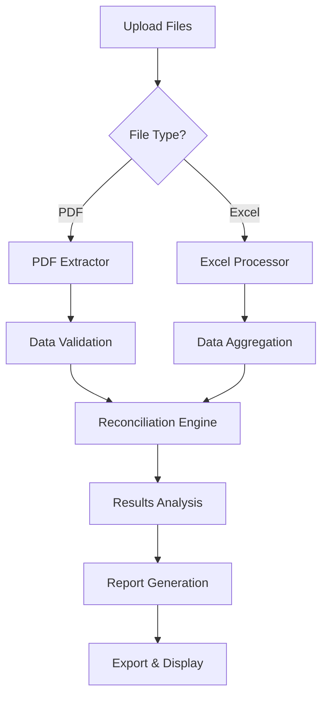

# 📄📊 Application Streamlit de Rapprochement PDF/Excel

Une application Streamlit simple pour rapprocher les données entre un fichier PDF et un fichier Excel.

## 🚀 Installation et Exécution

### Prérequis
- Python 3.7 ou supérieur

### Installation des dépendances
```bash
pip install -r requirements.txt
```

### Lancement de l'application
```bash
streamlit run streamlit_app.py
```

L'application sera accessible à l'adresse : http://localhost:8501

## 📖 Utilisation

1. **Uploadez un fichier PDF** contenant du texte extractible
2. **Uploadez un fichier Excel** (formats supportés: .xlsx, .xls, .csv)
3. L'application va automatiquement:
   - Extraire le texte du PDF
   - Afficher un aperçu du fichier Excel
   - Rechercher les valeurs des cellules Excel dans le texte PDF
   - Afficher les correspondances trouvées
4. **Téléchargez les résultats** au format CSV

## 🔧 Fonctionnalités

- ✅ Extraction de texte PDF avec `pdfplumber`
- ✅ Lecture de fichiers Excel (.xlsx, .xls) et CSV
- ✅ Rapprochement simple basé sur la recherche de chaînes
- ✅ Interface intuitive avec Streamlit
- ✅ Aperçu des données avant traitement
- ✅ Export des résultats en CSV
- ✅ Statistiques de rapprochement

---

# 🚀 Version Avancée - Beeline

Une application web moderne pour le rapprochement automatique entre factures PDF et données Excel détaillées.


## ✨ Fonctionnalités

### 🔍 **Extraction Intelligente**
- **PDF natif** : Extraction réelle avec `pdfplumber`
- **Excel/CSV** : Support complet avec détection automatique
- **Validation** : Contrôles de qualité intégrés

### ⚖️ **Rapprochement Avancé**
- **Multi-niveaux** : Exact → Partiel → Fuzzy → Contextuel
- **IA intégrée** : Algorithmes de correspondance intelligents
- **Scoring** : Évaluation de confiance pour chaque match

### 📊 **Interface Moderne**
- **Design responsive** : Desktop, tablette, mobile
- **Upload drag & drop** : Interface intuitive
- **Graphiques interactifs** : Plotly pour visualisations
- **Export multiple** : Excel, CSV, JSON

### 📧 **Notifications**
- **Email automatique** : Envoi optionnel des résultats
- **Historique** : Suivi des traitements passés

## 🚀 Déploiement Rapide

### **Option 1 : Streamlit Cloud (Recommandée)**

1. **Fork ce repository** sur votre compte GitHub

2. **Connectez-vous à [share.streamlit.io](https://share.streamlit.io)**

3. **Créez une nouvelle app** :
   - Repository : `votre-username/beeline-app`
   - Branch : `main`
   - Main file : `app.py`

4. **Déployez** en un clic ! 🎉

### **Option 2 : Déploiement local**

```bash
# Cloner le repository
git clone https://github.com/votre-username/beeline-app.git
cd beeline-app

# Installer les dépendances
pip install -r requirements.txt

# Lancer l'application
streamlit run app.py
```

L'application sera accessible sur `http://localhost:8501`

## 📁 Structure du Projet

```
beeline-app/
├── 📄 app.py                    # Application Streamlit principale
├── 📄 pdf_extractor.py          # Module d'extraction PDF
├── 📄 excel_processor.py        # Module de traitement Excel
├── 📄 reconciliation.py         # Moteur de rapprochement
├── 📄 requirements.txt          # Dépendances Python
├── 📄 README.md                 # Ce fichier
├── 📄 .gitignore                # Fichiers à ignorer
└── 📁 .streamlit/
    └── 📄 config.toml           # Configuration Streamlit
```

## 🛠️ Configuration

### **Variables d'environnement (optionnel)**

Créez un fichier `.streamlit/secrets.toml` pour les configurations sensibles :

```toml
# Configuration email (optionnel)
[email]
smtp_server = "smtp.gmail.com"
smtp_port = 587
username = "votre-email@gmail.com"
password = "votre-mot-de-passe-app"

# Configuration avancée
[app]
max_file_size = 50  # MB
session_timeout = 7200  # secondes
```

### **Configuration Streamlit**

Fichier `.streamlit/config.toml` :

```toml
[theme]
primaryColor = "#2e86ab"
backgroundColor = "#f0f2f6"
secondaryBackgroundColor = "#e0e0ef"
textColor = "#262730"

[server]
maxUploadSize = 50
maxMessageSize = 200

[browser]
gatherUsageStats = false
```

## 📖 Guide d'utilisation

### **1. Upload des fichiers**
- 📄 **PDFs** : Déposez vos factures PDF dans la zone de drop
- 📊 **Excel** : Uploadez vos fichiers Excel/CSV avec données détaillées

### **2. Configuration du rapprochement**
- **Tolérance** : Ajustez le pourcentage d'écart accepté (défaut: 1%)
- **Méthode** : Choisissez Exact, Partiel ou Intelligent
- **Email** : Optionnel pour recevoir les résultats

### **3. Lancement du traitement**
- Cliquez sur **"🚀 Lancer le Rapprochement"**
- Suivez la progression en temps réel
- Consultez les résultats détaillés

### **4. Analyse des résultats**
- **Dashboard** : Métriques et graphiques interactifs
- **Matches** : Rapprochements parfaits
- **Écarts** : Différences détectées avec priorités
- **Non-matchés** : Éléments orphelins avec diagnostic

### **5. Export et partage**
- **Excel complet** : Rapport avec tous les onglets
- **CSV** : Données pour analyse externe
- **Email** : Partage automatique des résultats

## 🔧 Développement

### **Installation développement**

```bash
# Cloner en mode développement
git clone https://github.com/votre-username/beeline-app.git
cd beeline-app

# Environnement virtuel
python -m venv venv
source venv/bin/activate  # Linux/Mac
# ou
venv\Scripts\activate  # Windows

# Dépendances + outils dev
pip install -r requirements.txt
pip install pytest black flake8 mypy

# Tests
pytest

# Formatage code
black *.py

# Lancement développement
streamlit run app.py --server.runOnSave=true
```

### **Structure des modules**

#### **app.py** - Interface principale
- Gestion des pages et navigation
- Upload et prévisualisation des fichiers
- Affichage des résultats et graphiques
- Exports et téléchargements

#### **pdf_extractor.py** - Extraction PDF
- Parsing natif avec `pdfplumber`
- Patterns spécialisés Randstad/Beeline
- Validation et scoring de qualité
- Extraction de tableaux

#### **excel_processor.py** - Traitement Excel
- Support Excel (.xlsx, .xls) et CSV
- Mapping intelligent des colonnes
- Validation ligne par ligne
- Agrégation par numéro de commande

#### **reconciliation.py** - Moteur de rapprochement
- Algorithmes multi-niveaux
- Scoring de confiance
- Analyse de performance
- Recommandations intelligentes

## 🎯 Formats Supportés

### **PDFs**
- ✅ Factures Randstad standard
- ✅ Autofactures Beeline
- ✅ Documents structurés avec tableaux
- ⚠️ PDFs scannés (OCR limité)

### **Excel/CSV**
- ✅ Fichiers .xlsx (Excel moderne)
- ✅ Fichiers .xls (Excel ancien)
- ✅ Fichiers .csv (tous délimiteurs)
- ✅ Encodages : UTF-8, Latin-1, CP1252

### **Colonnes Excel attendues**
- 🔴 **Requises** : N° commande, Montant net
- 🟡 **Importantes** : Collaborateur, Date
- 🟢 **Optionnelles** : Fournisseur, Unités, Taux

## 🔍 Algorithme de Rapprochement

### **Phase 1 : Exact** (Priorité haute)
- Correspondance directe par n° de commande
- Validation des montants avec tolérance

### **Phase 2 : Partiel** (Priorité moyenne)
- Correspondance par début de n° commande
- Scoring de similarité des chaînes
- Validation croisée des montants

### **Phase 3 : Fuzzy** (Priorité faible)
- Rapprochement par montants proches
- Tolérance élargie (5x la normale)
- Bonus pour cohérence dates/fournisseurs

### **Phase 4 : Contextuel** (Dernier recours)
- Correspondance par fournisseur + période
- Analyse temporelle et contextuelle
- Scoring de confiance pondéré

## 📈 Métriques de Performance

### **Indicateurs Clés**
- **Taux de Rapprochement** : % de PDFs matchés parfaitement
- **Taux de Couverture** : % de PDFs traités (matches + écarts)
- **Score de Qualité** : Évaluation globale sur 100 points
- **Temps de Traitement** : Performance en secondes

### **Scoring de Qualité**
- 🟢 **A (90-100)** : Excellent
- 🟡 **B (80-89)** : Très bon  
- 🟠 **C (70-79)** : Correct
- 🔴 **D (60-69)** : Passable
- ⚫ **F (<60)** : Insuffisant

## 🚨 Résolution des Problèmes

### **Problème : "Aucune donnée extraite des PDFs"**
**Solutions :**
- Vérifiez que les PDFs ne sont pas des images scannées
- Contrôlez la structure des factures (tableaux présents)
- Testez avec un PDF simple d'abord

### **Problème : "Colonnes Excel non reconnues"**
**Solutions :**
- Vérifiez les noms de colonnes (voir section Formats)
- Assurez-vous que la première ligne contient les en-têtes
- Convertissez les CSV avec le bon délimiteur

### **Problème : "Taux de rapprochement faible"**
**Solutions :**
- Contrôlez la cohérence des n° de commande
- Ajustez la tolérance des montants
- Vérifiez les dates de facturation

### **Problème : "Application lente"**
**Solutions :**
- Limitez à 20-30 fichiers par traitement
- Compressez les PDFs volumineux
- Utilisez des fichiers Excel plutôt que CSV lourds

## 🔐 Sécurité et Confidentialité

### **Données**
- ✅ **Traitement local** : Aucune donnée envoyée vers des serveurs tiers
- ✅ **Session temporaire** : Données effacées après traitement
- ✅ **Pas de stockage** : Aucune sauvegarde permanente des fichiers

### **Déploiement**
- ✅ **HTTPS** : Chiffrement des communications
- ✅ **Variables d'environnement** : Configuration sécurisée
- ✅ **Pas de logs sensibles** : Informations personnelles non enregistrées

## 🤝 Contribution

### **Comment contribuer**

1. **Fork** le repository
2. **Créez une branche** : `git checkout -b feature/amelioration`
3. **Commitez** : `git commit -m "Ajout fonctionnalité X"`
4. **Push** : `git push origin feature/amelioration`
5. **Pull Request** vers la branche main

### **Standards de code**
```bash
# Formatage automatique
black *.py

# Vérification style
flake8 *.py

# Type checking
mypy *.py

# Tests
pytest -v
```

### **Zones d'amélioration**
- 🎯 **Extraction PDF** : Support de nouveaux formats
- 📊 **Visualisations** : Nouveaux graphiques interactifs
- 🤖 **IA/ML** : Amélioration des algorithmes de matching
- 🌐 **Internationalisation** : Support multilingue
- 📧 **Notifications** : Integration avec Slack, Teams

## 📚 Documentation Technique

### **Architecture**
```
┌─ Interface Web (Streamlit) ─┐
│  ├─ Pages & Navigation      │
│  ├─ Upload & Preview        │
│  └─ Results & Export        │
└──────────────────────────────┘
           │
┌─ Couche Métier ─────────────┐
│  ├─ PDF Extractor           │
│  ├─ Excel Processor         │
│  └─ Reconciliation Engine   │
└──────────────────────────────┘
           │
┌─ Couche Données ────────────┐
│  ├─ Pandas DataFrames       │
│  ├─ Validation Rules        │
│  └─ Export Formats          │
└──────────────────────────────┘
```

### **Flux de traitement**


## 📊 Benchmarks

### **Performance moyenne** (ordinateur standard)
- **10 PDFs + 1 Excel** : ~15 secondes
- **50 PDFs + 5 Excel** : ~2 minutes  
- **100 PDFs + 10 Excel** : ~5 minutes

### **Limites recommandées**
- **Fichiers simultanés** : 100 max
- **Taille par fichier** : 50 MB max
- **Lignes Excel total** : 10,000 max
- **Session** : 2 heures max

## 🆕 Changelog

### **v2.0.0** (2025-09-25)
- ✨ **Nouveau** : Rapprochement intelligent multi-niveaux
- ✨ **Nouveau** : Interface Streamlit moderne
- ✨ **Nouveau** : Extraction PDF native avec pdfplumber
- ✨ **Nouveau** : Scoring de qualité automatique
- ✨ **Nouveau** : Export multiple formats
- ✨ **Nouveau** : Notifications email

### **v1.0.0** (Version Google Apps Script)
- ✅ Rapprochement basique
- ✅ Interface simple
- ❌ Extraction PDF limitée

## 📞 Support

### **Issues GitHub**
Pour signaler un bug ou demander une fonctionnalité :
[Créer une issue](https://github.com/votre-username/beeline-app/issues)

### **Documentation**
- **Wiki** : Documentation détaillée
- **Examples** : Fichiers d'exemple
- **FAQ** : Questions fréquentes

## 📜 Licence

```
MIT License

Copyright (c) 2025 Beeline Reconciliation App

Permission is hereby granted, free of charge, to any person obtaining a copy
of this software and associated documentation files (the "Software"), to deal
in the Software without restriction, including without limitation the rights
to use, copy, modify, merge, publish, distribute, sublicense, and/or sell
copies of the Software, and to permit persons to whom the Software is
furnished to do so, subject to the following conditions:

The above copyright notice and this permission notice shall be included in all
copies or substantial portions of the Software.

THE SOFTWARE IS PROVIDED "AS IS", WITHOUT WARRANTY OF ANY KIND, EXPRESS OR
IMPLIED, INCLUDING BUT NOT LIMITED TO THE WARRANTIES OF MERCHANTABILITY,
FITNESS FOR A PARTICULAR PURPOSE AND NONINFRINGEMENT. IN NO EVENT SHALL THE
AUTHORS OR COPYRIGHT HOLDERS BE LIABLE FOR ANY CLAIM, DAMAGES OR OTHER
LIABILITY, WHETHER IN AN ACTION OF CONTRACT, TORT OR OTHERWISE, ARISING FROM,
OUT OF OR IN CONNECTION WITH THE SOFTWARE OR THE USE OR OTHER DEALINGS IN THE
SOFTWARE.
```

## 🙏 Remerciements

- **Streamlit Team** : Framework web Python extraordinaire
- **pdfplumber** : Extraction PDF native et robuste
- **Pandas Team** : Manipulation de données inégalée
- **Plotly** : Visualisations interactives magnifiques

---

## 🚀 **Démarrage Rapide - Checklist**

- [ ] Fork ce repository sur GitHub
- [ ] Connectez-vous à [share.streamlit.io](https://share.streamlit.io)
- [ ] Créez une nouvelle app pointant vers votre repository
- [ ] Testez avec vos fichiers PDF/Excel
- [ ] Partagez l'URL avec votre équipe
- [ ] 🎉 **Votre application est en ligne !**

**Questions ?** Consultez la [documentation complète](https://github.com/votre-username/beeline-app/wiki) ou [créez une issue](https://github.com/votre-username/beeline-app/issues).

---

<div align="center">

**Fait avec ❤️ pour simplifier le rapprochement de données**

[⭐ Star ce repo](https://github.com/votre-username/beeline-app) si ça vous aide !

</div>
